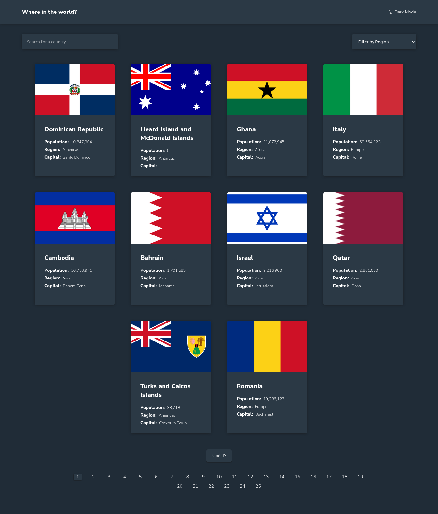

# Frontend Mentor - REST Countries API with color theme switcher solution

This is a solution to the [REST Countries API with color theme switcher challenge on Frontend Mentor](https://www.frontendmentor.io/challenges/rest-countries-api-with-color-theme-switcher-5cacc469fec04111f7b848ca). Frontend Mentor challenges help you improve your coding skills by building realistic projects.

## Table of contents

- [Overview](#overview)
  - [The challenge](#the-challenge)
  - [Screenshot](#screenshot)
  - [Links](#links)
- [My process](#my-process)
  - [Built with](#built-with)
  - [What I learned](#what-i-learned)
- [Author](#author)

## Overview

### The challenge

Users should be able to:

- See all countries from the API on the homepage
- Search for a country using an `input` field
- Filter countries by region
- Click on a country to see more detailed information on a separate page
- Click through to the border countries on the detail page
- Toggle the color scheme between light and dark mode _(optional)_

### Screenshot



### Links

- Solution URL: [Solution](https://www.frontendmentor.io/solutions/reactjs-styledcomponents-reactrouter-loadingskeleton-iBjXYt3W3n)
- Live Site URL: [Live Site](https://rest-countries-chiziivictor.netlify.app/)

## My process

### Built with

- Semantic HTML5 markup
- Flexbox
- Mobile-first workflow
- [React](https://reactjs.org/) - JS library
- [Styled Components](https://styled-components.com/) - For styles

### What I learned

Learned theming with styled components, pagination with ReactJS, and discovered how insanely annoying it can be to style select forms, lol...

It's wrong to nest interactive html elements like a tags in a button for example

```html
<button>
  <a href="#"> Click me </a>
</button>
```

## Author

- Website - [Chizi Victor](https://chizi.dev)
- Frontend Mentor - [@chiziivictor](https://www.frontendmentor.io/profile/chiziivictor)
- Twitter - [@chiziivictor](https://www.twitter.com/chizidotdev)
